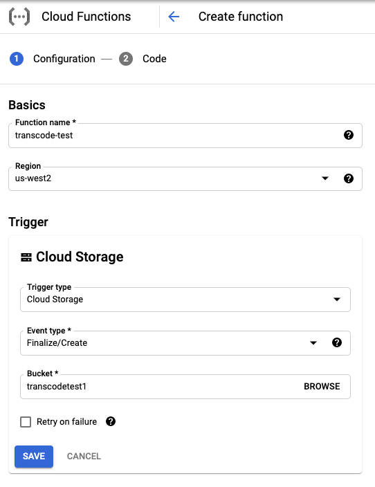
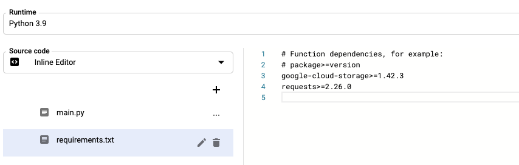
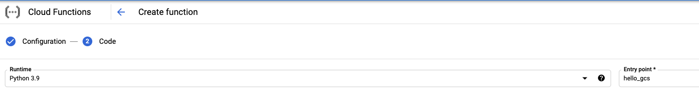

# Google Cloud Storage Auto Transcode with Dolby.io

! Read the [associated blog post](https://dolby.io/blog/automating-dolby-io-media-workflows-with-google-cloud-functions/) for more context of this project !

A sample application for [Google Cloud Functions](https://cloud.google.com/functions) to use Dolby.io's [Media APIs](https://docs.dolby.io/media-apis/docs) to automatically transcode any new files uploaded to a [Cloud Storage](https://cloud.google.com/storage) Bucket.

## Setup

You will need to use your own Google Cloud project as the basis of this automation.

Ensure that in configuring the automation, the **Trigger type** is set to **Cloud Storage** and **Event type** is set to [Finalize/Create](https://cloud.google.com/functions/docs/calling/storage#finalize).

You will also want to ensure your `requirements.txt` contains the required packages.

This application was made using the Python 3.9 runtime. All other versions have not been tested for compatibility.

## File Structure

The code used for the Google Cloud Function lives in the `cloud-function` folder.

- `main.py`: The main file used to call the Dolby.io API
- `signedUrls.py`: A helper file containing code to create [Presigned URLs](https://cloud.google.com/storage/docs/access-control/signed-urls) to read and write the files from
- `requirements.txt`: The list of Python packages Cloud Functions needs to install for the run to be successful.

## Additional Notes

Upon execution, the function will log a job id that will contain the status. To see the job's status, use [the get status endpoint](https://docs.dolby.io/media-apis/reference/media-enhance-get).

Logic to ensure no post-processed files are ran through the pipeline is necessary to prevent infinite loops. Depending on your workflow, modify the logic to exit on a processed file, whether that be by file extension, name or other methods.
